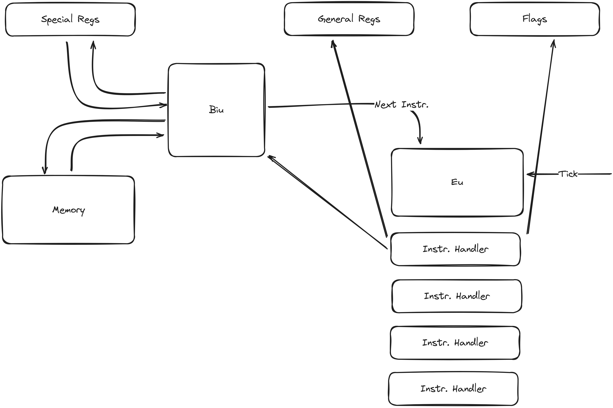

# 8086 Emulator

8086 is an interpreter/emulator of the assembler for Intel's 8086 processor.

The application's primary goal is to allow writing an assembler code, compiling it, and running with a preview of values in the memory and registers.

The project is built as the Blazor WebAssembly application.

> The made in the competition [100 Commitów](https://100commitow.pl)

## Assumptions / goals

The assumption for the project is to use memory space for data AND code. It means that I'm going to store encoded opcodes as the hex values in code space.

The first target of the implementation is to have foundation with covered:
[ ] Parsing input code
[ ] Encoder for 2-3 opcodes
[ ] Mechanism to get the next opcode from memory
[ ] Update cells in memory and/or registry

I skip the problem of counting clock ticks for each opcode. I assume that each opcode requires one tick of clock. It'll allow build mechnism to run code step-by-step in simple way.

# Architecture

## Components

# Contact

If you want to contact me, send a message to this e-mail address:
contact@zajacmarek.com